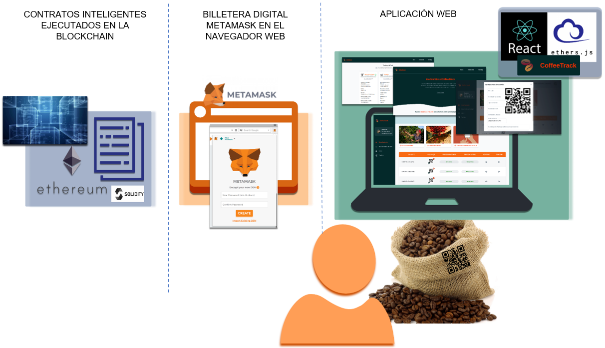

# Sistema de tracking de la cadena de suministro del café basado en la tecnología blockchain

## Descripción

---

Este proyecto tiene como objetivo rastrear la cadena de suministro del café de especialidad desde la producción de los granos de café hasta la comercialización en retailer de una funda de café de especialidad, para lo cual emplea la tecnología blockchain.

La arquitectura completa del sistema de tracking consta de 3 componentes:

1. Contratos inteligentes desarrollados en el lenguaje de programación Solidity y ejecutados en la testnet Rinkeby, los cuales describen toda la lógica del sistema de tracking implementado.

2. Integración entre la aplicación web con los contratos inteligentes por medio de la billetera digital MetaMask, instalada como extensión del navegador web.

3. Aplicación web basada en React como librería de desarrollo y Ethers.js como librería para interactuar con el ecosistema de la cadena de bloques de Ethereum. El código fuente de la aplicación web puede consultarse [aquí](https://github.com/NathaliaBarreiros/coffee-supply-chain-client).

<p align="center">
  
</p>

## Contratos inteligentes

---

Este proyecto describe la implementación de los contratos inteligentes. Se empleó el entorno de desarrollo y marco de pruebas de Truffle para desarrollar los contratos inteligentes, los scripts de despliegue y los tests.

En el script [truffle-config.js](https://github.com/NathaliaBarreiros/coffee-supply-chain-tracking-system-ethereum/blob/main/truffle-config.js)
se establecen las conexiones de red a la blockchain testnet Rinkeby y a la blockchain local utilizando la herramienta Ganache de Truffle Suite.

### Etapas del sistema de tracking según los roles modificadores en la cadena de suministro del café de especialidad

---

1. Registro de granja | **Rol:** Administrador del sistema
2. Registro de información de cosecha | **Rol:** Agricultor y Vendedor de Granos de Café
3. Registro de información de procesado | **Rol:** Procesador
4. Registro de información de catación | **Rol:** Catador
5. Registro de información de venta de café | **Rol:** Agricultor y Vendedor de Granos de Café
6. Registro de información de bodegaje | **Rol:** Bodega
7. Registro de información de transporte a empacador | **Rol:** Transportista a Empacador
8. Registro de información de empacado | **Rol:** Empacador
9. Registro de información de transporte a retailer | **Rol:** Transportista a Retailer
10. Registro de información de comercialización en retailer | **Rol:** Retailer

### Diagrama de estados de los contratos inteligentes

---

El diagrama de estados muestra el flujo de funcionamiento del sistema de tracking implementado en los contratos inteligentes.

<p align="center">
  
</p>

### Diagrama de modelo de los contratos inteligentes

---

El diagrama de modelo del sistema especifica cada una de las funciones implementadas en los contratos inteligentes.

<p align="center">
  
</p>

### Diagrama de secuencia de los contratos inteligentes

---

Los diagramas de secuencia representan la interacción entre los usuarios con cada contrato desarrollado e interacción entre contratos.

- Primer diagrama de secuencia está enfocado en las funciones de escritura y en los eventos emitidos en la blockchain para las etapas desde el registro
de la granja hasta la venta de café.
<p align="center">
  
</p>

- Segundo diagrama de secuencia está enfocado en las funciones de escritura y en los eventos emitidos en la blockchain para las etapas desde bodegaje hasta la comercialización en retailer.
<p align="center">
  
</p>

- Tercer diagrama de secuencia está enfocado en las funciones de lectura para todas las etapas de la cadena de suministro de café.
<p align="center">
  
</p>

### Diagrama de entidad relación de los contratos inteligentes

---

Este diagrama especifica las variables con su tipo de
dato, las funciones, los atributos y las llamadas de función que presentan las diferentes entidades.

<p align="center">
  
</p>

## Ejecución del proyecto

---

### Requisitos previos para correr el proyecto

---

- Sistema Operativo: Linux Ubuntu 20.04 LTS +
- Nodejs: v16.15.0
- Truffle: v5.4.32
- Solidity Compiler: v0.8.16
- Git: v2.26.2
- Aplicación de escritorio de Ganache: v2.5.4

### Pasos de implementación

---

1. Una vez verificado la instalación de los requisitos previos, clonar el repositorio de GitHub (https://github.com/NathaliaBarreiros/coffee-supply-chain-tracking-systemethereum) en el directorio deseado y acceder a la carpeta del proyecto. Para esto se ejecutan los siguientes comandos en una terminal del directorio:

```
git clone https://github.com/NathaliaBarreiros/coffee-supply-chain-tracking-system-ethereum.git
cd coffee-supply-chain-tracking-system-ethereum/
```

2. Establecer las variables de entorno del proyecto. Para esto se crea un archivo .env en la carpeta raíz del proyecto, se copia el contenido del archivo [.env.example](https://github.com/NathaliaBarreiros/coffee-supply-chain-tracking-system-ethereum/blob/main/.env.example)

y se configuran las variables de entorno de manera personalizada.

3. Instalación de librerías requeridas, compilación y despliegue de los contratos, se ejecutan los comandos:

```
rm -rf build/
npm install @truffle/hdwallet-provider
npm install truffle-plugin-verify
truffle compile
truffle migrate --network rinkeby reset
```

Después de la implementación exitosa se obtiene una respuesta en la terminal como se muestra a continuación:

```
Compiling your contracts...
===========================
> Everything is up to date, there is nothing to compile.


Starting migrations...
======================
> Network name:    'rinkeby'
> Network id:      4
> Block gas limit: 30000000 (0x1c9c380)


1_initial_migration.js
======================

   Deploying 'Migrations'
   ----------------------
   ⠋ Blocks: 0            Seconds: 0   > transaction hash:    0xbea85d28fcea135158bfca3d2eadf3b04052a6065461685d262282960f400677
   > Blocks: 0            Seconds: 0
   > contract address:    0xB4a1eB8Abe2ed52Fc47C01507BDfcAe4E327D357
   > block number:        11319277
   > block timestamp:     1662257932
   > account:             0x9E733B413600444663EF0FFd8116A279D8C07D7D
   > balance:             0.116358107182292588
   > gas used:            250154 (0x3d12a)
   > gas price:           2.500000007 gwei
   > value sent:          0 ETH
   > total cost:          0.000625385001751078 ETH

   Pausing for 2 confirmations...

   -------------------------------
   > confirmation number: 1 (block: 11319278)
   > confirmation number: 2 (block: 11319279)

   > Saving migration to chain.
   > Saving artifacts
   -------------------------------------
   > Total cost:     0.000625385001751078 ETH


2_deploy_contracts.js
=====================

   Deploying 'SupplyChainStorage'
   ------------------------------
   ⠋ Blocks: 0            Seconds: 0   > transaction hash:    0x4e677839f3ad88fb960a517d25c81e99652d8926054c3305b22e720eafe1d6b5
   ⠴ Blocks: 0            Seconds: 0undefined
   ⠴ Blocks: 0            Seconds: 4undefined
   ⠧ Blocks: 0            Seconds: 8undefined
   > Blocks: 0            Seconds: 12
   > contract address:    0x7F40AEd3B6c1584Dd5285cDbAc5310D1787648EB
   > block number:        11319281
   > block timestamp:     1662257992
   > account:             0x9E733B413600444663EF0FFd8116A279D8C07D7D
   > balance:             0.1067618971554232
   > gas used:            3792571 (0x39debb)
   > gas price:           2.500000007 gwei
   > value sent:          0 ETH
   > total cost:          0.009481427526547997 ETH

   Pausing for 2 confirmations...

   -------------------------------
   > confirmation number: 1 (block: 11319282)
   > confirmation number: 2 (block: 11319283)

   Deploying 'SupplyChainStorage2'
   -------------------------------
   ⠋ Blocks: 0            Seconds: 0   > transaction hash:    0xaaf21c017130d07926f7c65ec5b91f25eece4735216873050b0867ac10d5ddf3
   ⠴ Blocks: 0            Seconds: 0undefined
   ⠴ Blocks: 0            Seconds: 4undefined
   ⠴ Blocks: 0            Seconds: 8undefined
   > Blocks: 1            Seconds: 12
   > contract address:    0xE7114eb40Dc78c08AE576F73A29CEb49f4463Ac3
   > block number:        11319284
   > block timestamp:     1662258037
   > account:             0x9E733B413600444663EF0FFd8116A279D8C07D7D
   > balance:             0.098740154632962321
   > gas used:            3208697 (0x30f5f9)
   > gas price:           2.500000007 gwei
   > value sent:          0 ETH
   > total cost:          0.008021742522460879 ETH

   Pausing for 2 confirmations...

   -------------------------------
   > confirmation number: 1 (block: 11319285)
   > confirmation number: 2 (block: 11319286)

   Deploying 'CoffeeSupplyChain'
   -----------------------------
   ⠋ Blocks: 0            Seconds: 0   > transaction hash:    0x29a4fe10b0ebc77590d60661e6475fd4bebf59996de8f554171fce1966174cf6
   ⠴ Blocks: 0            Seconds: 0undefined
   ⠴ Blocks: 0            Seconds: 4undefined
   > Blocks: 0            Seconds: 8
   > contract address:    0xfe362d073664CE9c80E15fE257cB38342F085101
   > block number:        11319287
   > block timestamp:     1662258082
   > account:             0x9E733B413600444663EF0FFd8116A279D8C07D7D
   > balance:             0.091260414612019049
   > gas used:            2991896 (0x2da718)
   > gas price:           2.500000007 gwei
   > value sent:          0 ETH
   > total cost:          0.007479740020943272 ETH

   Pausing for 2 confirmations...

   -------------------------------
   > confirmation number: 1 (block: 11319288)
   > confirmation number: 2 (block: 11319289)

   Deploying 'CoffeeSupplyChain2'
   ------------------------------
   ⠋ Blocks: 0            Seconds: 0   > transaction hash:    0x19b9144f2362f97544ba3fd92fcddffdda14745187180ad0f8d3e91995f30cde
   ⠼ Blocks: 0            Seconds: 0undefined
   ⠼ Blocks: 0            Seconds: 4undefined
   ⠼ Blocks: 0            Seconds: 8undefined
   > Blocks: 0            Seconds: 12
   > contract address:    0xcc3024F334b2063A2D5315B193761207f55a902d
   > block number:        11319290
   > block timestamp:     1662258128
   > account:             0x9E733B413600444663EF0FFd8116A279D8C07D7D
   > balance:             0.083891634591386465
   > gas used:            2947512 (0x2cf9b8)
   > gas price:           2.500000007 gwei
   > value sent:          0 ETH
   > total cost:          0.007368780020632584 ETH

   Pausing for 2 confirmations...

   -------------------------------
   > confirmation number: 1 (block: 11319291)
   > confirmation number: 2 (block: 11319292)

   Deploying 'SupplyChainUser'
   ---------------------------
   ⠋ Blocks: 0            Seconds: 0   > transaction hash:    0xa12cd7594226656837c8b89e4f324a35fdaed6c51482d33eb7bb78cdbf6e7df2
   ⠦ Blocks: 0            Seconds: 0undefined
   ⠦ Blocks: 0            Seconds: 4undefined
   ⠦ Blocks: 0            Seconds: 8undefined
   > Blocks: 0            Seconds: 12
   > contract address:    0x6e0102F459F3d69783804d94b61060BC0374e850
   > block number:        11319293
   > block timestamp:     1662258173
   > account:             0x9E733B413600444663EF0FFd8116A279D8C07D7D
   > balance:             0.081000177083290384
   > gas used:            1156583 (0x11a5e7)
   > gas price:           2.500000007 gwei
   > value sent:          0 ETH
   > total cost:          0.002891457508096081 ETH

   Pausing for 2 confirmations...

   -------------------------------
   > confirmation number: 1 (block: 11319294)
   > confirmation number: 2 (block: 11319295)

   > Saving migration to chain.
   > Saving artifacts
   -------------------------------------
   > Total cost:     0.035243147598680813 ETH

Summary
=======
> Total deployments:   6
> Final cost:          0.035868532600431891 ETH
```

Las direcciones de los contratos inteligentes pueden ser consultadas en el explorador Etherscan.

- [SupplyChainStorage.sol](https://rinkeby.etherscan.io/address/0x8d634bf42f06d7904dd46d8ed4ab345230a03b7d#code)
- [SupplyChainStorage2.sol](https://rinkeby.etherscan.io/address/0x1e3DDD059f0F01258A7baC74dfBA2cA43C33A449#code)
- [CoffeeSupplyChain.sol](https://rinkeby.etherscan.io/address/0xdf0C594655C466B0b37CeFc519f38Ea8fEB465F9#code)
- [CoffeeSupplyChain2.sol](https://rinkeby.etherscan.io/address/0xcf76465C29A32F11D6A27a009eE7CB500669c5Ff#code)
- [SupplyChainUser.sol](https://rinkeby.etherscan.io/address/0xbf87Fd7e3416311dbef4F00e2ce73950A0F2a0D2#code)

Las direcciones de los contratos `CoffeeSupplyChain.sol`, `CoffeeSupplyChain2.sol` y `SupplyChainUser.sol` deben
ser copiadas para configurar la [aplicación web](https://github.com/NathaliaBarreiros/coffee-supply-chain-client).

4. Para llevar a cabo la verificación de los contratos inteligentes desplegados en la testnet de Rinkeby, se ejecutan los siguientes comandos:

```
truffle run verify SupplyChainStorage –network rinkeby
truffle run verify SupplyChainStorage2 –network rinkeby
truffle run verify CoffeeSupplyChain –network rinkeby
truffle run verify CoffeeSupplyChain2 –network rinkeby
truffle run verify SupplyChainUser –network rinkeby

```

- Si se desean ejecutar las pruebas, usar los comandos:

```
truffle compile
truffle test –network ganache
```

- Para realizar los despliegues en la blockchain local con Ganache, usar los comandos:

```
truffle compile
truffle migrate –network ganache
```
